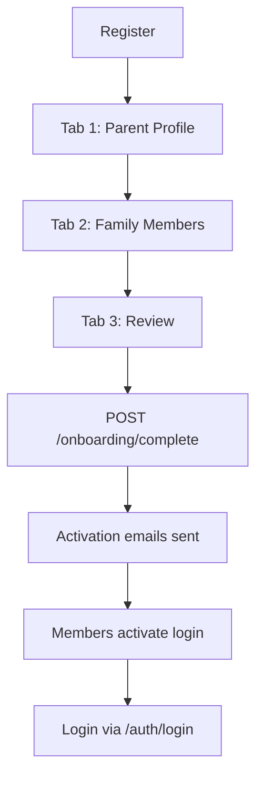

# Backend Overview — Solar Swim Gym

## Base API URL

```
http://localhost:3000/api/v1
```

---

## Core Backend Concept

The backend is designed around **profile-based login**, not account-only login.

### Key Principles

* **One family = one account** (billing owner)
* **Each person = one profile**
* **Each profile can log in independently**
* **Login happens using profile email + password**
* **Profiles are activated via email invitation after onboarding**

---

## Authentication Flow Overview

There are **two ways a profile becomes able to log in**:

1. **Primary parent** → created during onboarding
2. **Family member** → activated via email invite

> [!IMPORTANT]
> Only activated profiles can log in.

---

## API Routes Reference

### 1. Auth APIs

#### POST `/auth/login`

Used for logging in any profile (parent or member).

**Request Body:**
```json
{
  "email": "parent@example.com",
  "password": "password123"
}
```

**Behavior:**
* Authenticates against Profile table
* Returns access token
* Token represents logged-in profile
* Not account-level login

**Frontend Usage:**
* Login screen
* Authentication
* Session creation

---

### 2. Onboarding APIs

#### POST `/onboarding/complete`

This endpoint handles the **entire onboarding flow**.

**Creates:**
* Account
* Parent profile
* Family member profiles
* Parent–child relationships
* RCEB data
* Activation tokens for members

**Request Structure:**
```json
{
  "primary_profile": {
    "first_name": "John",
    "last_name": "Doe",
    "email": "john.doe@example.com",
    "password": "securePassword123",
    "mobile": "555-0123",
    "date_of_birth": "1985-05-15",
    "rceb_flag": true,
    "case_manager": {
      "name": "Jane Smith",
      "email": "jane.smith@rceb.org"
    }
  },
  "family_members": [
    {
      "first_name": "Child",
      "last_name": "One",
      "date_of_birth": "2018-02-10",
      "email": "child1@example.com",
      "rceb_flag": false,
      "services": [
        "5cd7c77b-9066-47a6-9bc9-cfbac0998fee" 
      ]
    },
    {
      "first_name": "Child",
      "last_name": "Two",
      "date_of_birth": "2015-06-22",
      "email": "child2@example.com",
      "rceb_flag": true,
      "services": [
        "5cd7c77b-9066-47a6-9bc9-cfbac0998fee",
        "95093809-9012-4a5f-9452-e125708db12e"
      ]
    }
  ]
}
```

**Backend Responsibilities:**
* Create Account
* Create Parent Profile
* Create Child Profiles
* Link all profiles under account_id
* Set parent_profile_id
* Store RCEB info per profile
* Generate activation tokens
* Send activation emails

**Frontend Notes:**
* This API is called only once at the end of onboarding
* Frontend should manage tabs locally
* Backend receives final payload only

---

### 3. Activation APIs

Used for profile email login activation.

#### GET `/activation/validate/:token`

Used when user clicks activation email link.

**Behavior:**
* Validates token
* Checks expiry
* Confirms profile exists
* Returns success/failure

**Frontend Usage:**
* Token validation screen
* Redirect decision

---

#### POST `/activation/activate`

Used to set password and activate profile login.

**Request Body:**
```json
{
  "token": "your_token_here",
  "password": "new_secure_password"
}
```

**Behavior:**
* Validates token again
* Hashes password
* Activates profile login
* Marks token as used

> [!NOTE]
> After this, the profile can log in normally using `/auth/login`.

---

### 4. Profile APIs

These APIs are used after login.

> [!IMPORTANT]
> All profile APIs require authentication header:
> ```
> Authorization: Bearer <accessToken>
> ```

#### GET `/profiles/me`

Returns currently logged-in profile.

**Purpose:**
* Show dashboard
* Know who is logged in
* Determine permissions

---

#### GET `/profiles/family`

Returns all profiles linked to the same account.

**Purpose:**
* Show family members
* Allow parent to manage children
* Display profiles in booking flow

---

### 5. Services APIs

#### GET `/services`

Returns master list of services.

**Examples:**
* Swimming
* Basketball
* Camps
* Fitness

**Frontend Usage:**
* Service listing
* Booking screens
* Enrollment UI

---

## Full Onboarding Flow (Frontend Perspective)



**Flow Steps:**
1. User starts registration
2. **Tab 1:** Parent Profile information
3. **Tab 2:** Family Members information
4. **Tab 3:** Review all information
5. Submit via `POST /onboarding/complete`
6. Backend sends activation emails
7. Family members activate their login
8. Login via `POST /auth/login`

---

## Frontend Integration Summary

### Authentication Pattern

```typescript
// The backend uses profile-based authentication
// Each person is a profile with its own email and password
// Account exists only for billing and ownership
```

### Onboarding Pattern

```typescript
// Onboarding is completed using ONE API call:
// POST /onboarding/complete
```

### Activation Pattern

```typescript
// Activation links are sent to each profile email
// Profiles activate login via:
// 1. GET /activation/validate/:token
// 2. POST /activation/activate
```

### Login Pattern

```typescript
// Login is done using:
// POST /auth/login
```

### Post-Login Pattern

```typescript
// After login:
// GET /profiles/me → current profile
// GET /profiles/family → all family members
```

### Services Pattern

```typescript
// Services are fetched using:
// GET /services
```

---

## Important Rules for Frontend

> [!CAUTION]
> * **Do not create accounts separately**
> * **Do not create profiles individually**
> * **Only onboarding API creates structure**
> * **Login is always profile-based**
> * **Payment and booking come later**

---

## Example Onboarding Payload

```json
{
  "primary_profile": {
    "first_name": "John",
    "last_name": "Doe",
    "email": "john.doe@example.com",
    "password": "securePassword123",
    "mobile": "555-0123",
    "date_of_birth": "1985-05-15",
    "rceb_flag": true,
    "case_manager": {
      "name": "Jane Smith",
      "email": "jane.smith@rceb.org"
    }
  },
  "family_members": [
    {
      "first_name": "Child",
      "last_name": "One",
      "date_of_birth": "2018-02-10",
      "email": "child1@example.com",
      "rceb_flag": false,
      "services": [
        "5cd7c77b-9066-47a6-9bc9-cfbac0998fee" 
      ]
    },
    {
      "first_name": "Child",
      "last_name": "Two",
      "date_of_birth": "2015-06-22",
      "email": "child2@example.com",
      "rceb_flag": true,
      "services": [
        "5cd7c77b-9066-47a6-9bc9-cfbac0998fee",
        "95093809-9012-4a5f-9452-e125708db12e"
      ]
    }
  ]
}
```

---

## Testing the API

You can test the API endpoints directly using tools like:
* Postman
* cURL
* Thunder Client (VS Code extension)
* Browser fetch/axios

**Base URL:** `http://localhost:3000/api/v1`

---

## Next Steps for Frontend Development

1. ✅ Create API service layer
2. ✅ Implement authentication context
3. ✅ Build onboarding flow (3 tabs)
4. ✅ Create activation flow
5. ✅ Implement login screen
6. ✅ Build dashboard (post-login)
7. ✅ Integrate services listing
