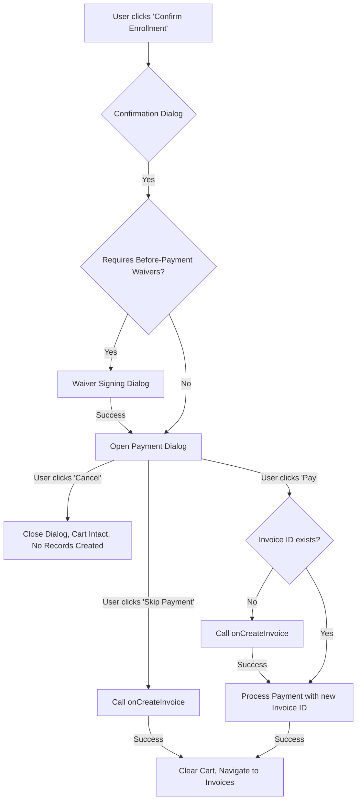

# Implementation Plan: Deferred Subscription and Invoice Creation

## Objective
Modify the checkout flow in the Marketplace component to delay the creation of subscriptions and invoices until the user clicks the "Pay" button in the payment dialog. This ensures that no records are created if the user cancels the process at the payment step.

## Proposed Changes

### 1. Refactor `Marketplace.tsx`
- **Extract Creation Logic**: Move the core logic for creating subscriptions and invoices from `processCheckout` into a new async function `handleCreateInvoiceForCheckout`.
- **Modify `processCheckout`**:
    - Remove direct calls to `billingService.createSubscription` and `billingService.createInvoice`.
    - Update the logic to only check for and handle "BEFORE_PAYMENT" waivers.
    - Once waivers are completed (or if none are required), open the `PaymentDialog` without a pre-created `invoiceId`.
- **Update Confirmation Dialog**:
    - Modify the text in the "Confirm Enrollment" dialog to inform users that subscriptions and invoices will be created during the payment step.
- **Pass Callback to `PaymentDialog`**:
    - Pass `handleCreateInvoiceForCheckout` as a prop to `PaymentDialog`.

### 2. Update `PaymentDialog.tsx`
- **Update Props**: Add `onCreateInvoice?: () => Promise<{ invoiceId: string; total: number }>` to the `PaymentDialogProps` interface.
- **Add Cancel & Return Button**:
    - Add a "Cancel & Return to Cart" button in the `DialogActions`.
    - Clicking this button will simply call `onClose()`, which returns the user to the `Marketplace` view with their cart intact. NO records are created.
- **Support Skip Payment**:
    - Ensure the "Skip Payment" button (if visible) triggers the `onSkip` callback.
    - In `Marketplace.tsx`, the `onSkip` callback must now call `handleCreateInvoiceForCheckout` first to ensure subscriptions/invoices are created in a `PENDING` state before clearing the cart and navigating.
- **Modify `handlePay`**:
    - Update the payment execution logic to check for a missing `invoiceId`.
    - If `invoiceId` is missing and `onCreateInvoice` is provided, call the callback to create the backend records first.
    - Use the resulting `invoiceId` to finalize the payment via `paymentService.payInvoice`.
- **Display Correct Total**: Ensure the dialog displays the total from the cart items passed as props.

### 3. Workflow Flowchart

## Success Criteria
1. Subscriptions and invoices are NOT created in the database until either "Pay" or "Skip Payment" is clicked.
2. Clicking "Cancel" returns the user to the marketplace with their cart unchanged and no backend records created.
3. Clicking "Skip Payment" creates the subscription and invoice in a `PENDING` state and concludes the flow.
4. Clicking "Pay" creates the records and attempts immediate payment processing.
5. Overall flow ensures atomicity (records are created only when the user commits to finishing the checkout).

## Files to be Modified
- `src/pages/Marketplace/Marketplace.tsx`
- `src/pages/Marketplace/PaymentDialog.tsx`
